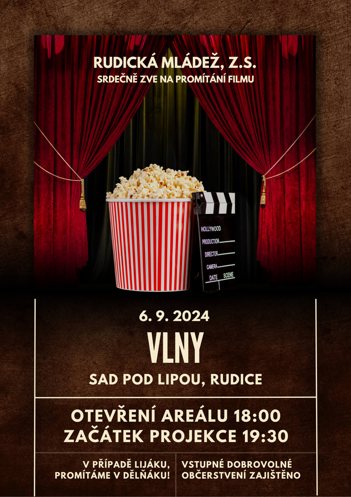

Léto je tady a&nbsp;s&nbsp;ním i&nbsp;rudické kino! 🎬
Srdečně vás zveme na naši již druhou projekci, která opět proběhne v&nbsp;krásném prostředí [Sadu pod Lipou](https://maps.app.goo.gl/PkK9S2EBhhUzFXkR6), nebojte v případě lijáku, promítáme v&nbsp;[dělňáku](https://maps.app.goo.gl/fRbT5FhzffHoAYcj7)!
Tentokrát jsme pro vás připravili film VLNY. 🎙🌊📻

Datum: 6.&nbsp;9.&nbsp;2024 📅

Abychom vám večer ještě více zpříjemnili, je pro vás zajištěno občerstvení – těšit se můžete na něco dobrého k&nbsp;snědku i&nbsp;pití. 🍿🍻

## O filmu 🎞

Dobový film Vlny režiséra Jiřího Mádla ukáže napínavé a&nbsp;doposud utajené příběhy novinářů Československého rozhlasu. Na konci 60. let, kdy zněl z rádiových vln rokenrol a&nbsp;studentské revolty měnily svět, nastoupí starší z bratrů do prestižní redakce rozhlasu. Záhy se ocitne v nebezpečném souboji redaktorů a&nbsp;tajných služeb. Ve víru událostí půjde brzy všem o&nbsp;život a&nbsp;hlavní hrdina stojí před drsnou volbou: ochránit bratra, nebo pravdu a&nbsp;kolegy? Film je inspirován skutečným příběhem skupiny novinářů mezinárodní redakce Československého rozhlasu a&nbsp;jejich odhodláním přinášet nezávislé zprávy za každou cenu ([Bontonfilm](http://www.bontonfilm.cz/))

## Zpětná vazba

Vaše názory a&nbsp;pocity nám můžete zasílat pomocí toho [formuláře](https://forms.gle/y7RKRcHLDMwksMAFA).

