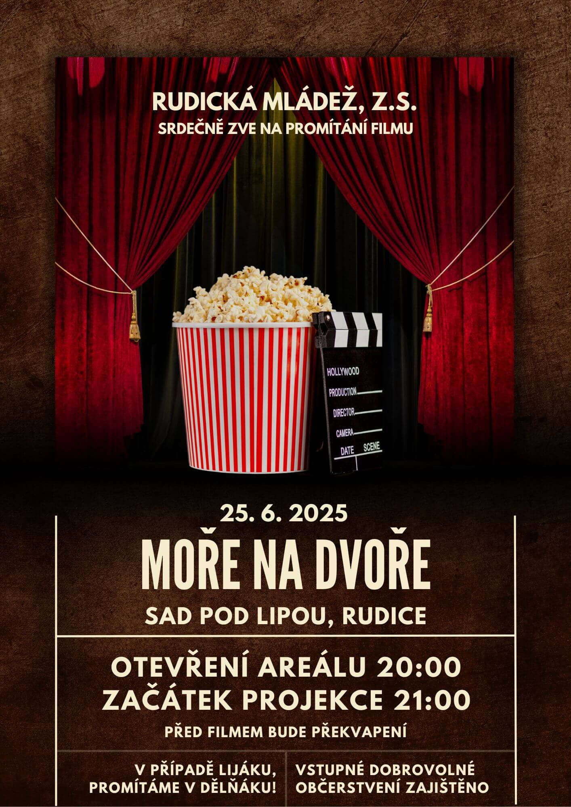

Srdečně vás zveme na naši letošní druhou projekci, která opět proběhne v&nbsp;krásném prostředí [Sadu pod Lipou](https://maps.app.goo.gl/PkK9S2EBhhUzFXkR6).
Nebojte v případě lijáku, promítáme v&nbsp;[dělňáku](https://maps.app.goo.gl/fRbT5FhzffHoAYcj7)!
Tentokrát jsme pro vás připravili film *Moře na dvoře*. 🌊🏠🎻

<!--more-->

Vstupné dobrovolné. 🎟 📽 \
Datum: 25.&nbsp;6.&nbsp;2025 📅

Abychom vám večer ještě více zpříjemnili, je pro vás zajištěno občerstvení – těšit se můžete na něco dobrého k&nbsp;snědku i&nbsp;pití. 🍿🍻

Vlastní židle vítány, avšak budou nachystány obecní pivní sety. 🪑

## O filmu 🎞

Sympatický Josef ([Ondřej Vetchý](https://www.csfd.cz/tvurce/1464-ondrej-vetchy/)) je úspěšný mistr houslař.
Těší ho, že jím vyrobené nástroje přinášejí radost lidem po celém světě.
On sám nejraději tráví čas ve své dílně na dvoře pavlačového domu.
Nikdy nebyl ani u&nbsp;moře, jeho mořem je louže na dvoře, kterou chrání před vyschnutím, aby ptáci měli co pít.
Nemá manželku ani děti, jen fenku Pampelišku, která ho doprovází na každém kroku.
Josef tajně miluje krásnou sousedku Anežku ([Linda Rybová](https://www.csfd.cz/tvurce/1299-linda-rybova/)) a&nbsp;těší se na středeční šachové partie s&nbsp;nejlepším kamarádem Václavem ([Jiří Langmajer](https://www.csfd.cz/tvurce/1528-jiri-langmajer/)), charismatickým ladičem pian, který dokáže skvěle naladit i&nbsp;většinu pianistek.
Přestože Josef vyrobil už řadu mistrovských nástrojů, ví, že jeho houslařské umění stále není na vrcholu.
Zatím váhá sáhnout po tom nejlepším dřevě, které v&nbsp;dílně pečlivě opatruje.
Má přece před sebou tolik času – na mistrovské housle i&nbsp;na seznámení s&nbsp;Anežkou.
Ale život se změní během okamžiku.
Z&nbsp;moře času se najednou může stát pouhá louže.
Josef si s&nbsp;pomocí přátel začíná plnit všechny sny, které už nechce odkládat.
A&nbsp;tak nakonec dojde na mistrovské housle i&nbsp;tu pravou lásku na celý život. ([Bontonfilm](http://www.bontonfilm.cz/))

## Zpětná vazba

Vaše názory a&nbsp;pocity nám můžete zasílat pomocí toho [formuláře](https://forms.gle/x2Aa51WE17773tqz9).

Navrhněte svůj oblíbený film do našeho výběru prostřednictvím krátkého formuláře: 📝 \
👉🏻 [Otevřít formulář](https://forms.gle/83aDkqcAj5nDmfj46)

