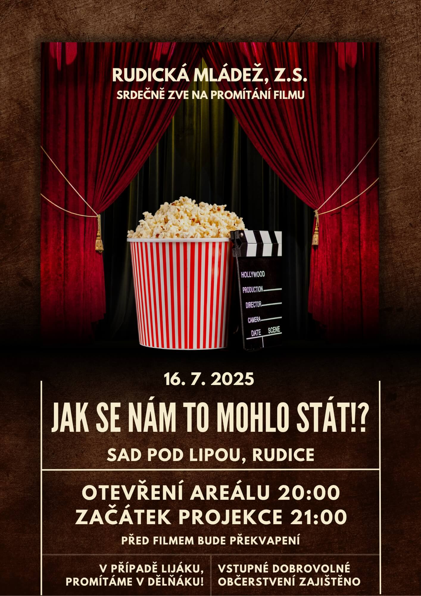

Srdečně vás zveme na naši letošní druhou projekci, která opět proběhne v&nbsp;krásném prostředí [Sadu pod Lipou](https://maps.app.goo.gl/PkK9S2EBhhUzFXkR6).
Nebojte v případě lijáku, promítáme v&nbsp;[dělňáku](https://maps.app.goo.gl/fRbT5FhzffHoAYcj7)!
Tentokrát jsme pro vás připravili film *Jak se nám to mohlo stát!?*. 🤔⁉️

<!--more-->

Vstupné dobrovolné. 🎟 📽 \
Datum: 16.&nbsp;7.&nbsp;2025 📅

Abychom vám večer ještě více zpříjemnili, je pro vás zajištěno občerstvení – těšit se můžete na něco dobrého k&nbsp;snědku i&nbsp;pití. 🍿🍻

Vlastní židle vítány, avšak budou nachystány obecní pivní sety. 🪑

## O filmu 🎞

Cimburk-Kolovratníkovi, početná aristokratická rodina, se při ohlášené svatbě svých dětí setkávají s&nbsp;mnohem skromnější rodinou Novákových.
Budoucí nevěsta a&nbsp;ženich při té příležitosti nabídnou svým rodičům testy DNA, které odhalí jejich skutečný původ.
Výsledky jsou naprosto nečekané a&nbsp;zapříčiní efekt bomby. ([Bohemia MP](http://www.bohemiamp.cz/))

## Zpětná vazba

Vaše názory a&nbsp;pocity nám můžete zasílat pomocí toho [formuláře](https://forms.gle/x2Aa51WE17773tqz9).

Navrhněte svůj oblíbený film do našeho výběru prostřednictvím krátkého formuláře: 📝 \
👉🏻 [Otevřít formulář](https://forms.gle/83aDkqcAj5nDmfj46)

