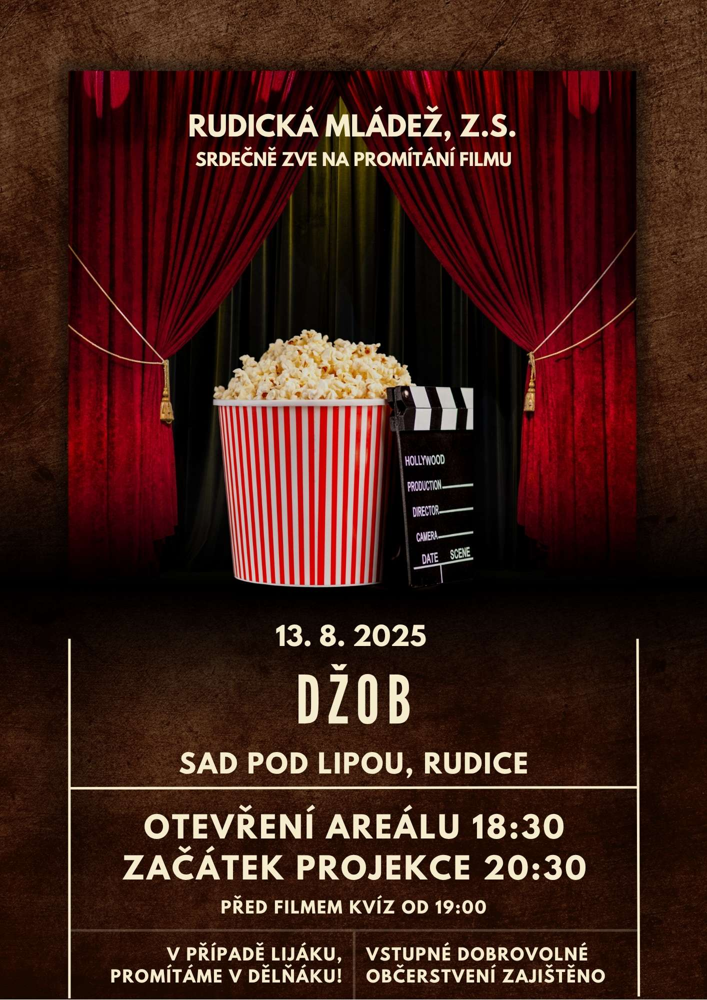

Srdečně vás zveme na naši letošní třetí projekci, která opět proběhne v krásném prostředí [Sadu pod Lipou](https://maps.app.goo.gl/PkK9S2EBhhUzFXkR6).
Nebojte v případě lijáku, promítáme v [dělňáku](https://maps.app.goo.gl/fRbT5FhzffHoAYcj7)!
Tentokrát jsme pro vás připravili film Džob. 👷🏻‍♂️👔🧰

<!--more-->

Vstupné dobrovolné. 🎟 📽 \
Datum: 13.&nbsp;8.&nbsp;2025 📅

Abychom vám večer ještě více zpříjemnili, je pro vás zajištěno občerstvení – těšit se můžete na něco dobrého k&nbsp;snědku i&nbsp;pití. 🍿🍻

Vlastní židle vítány, avšak budou nachystány obecní pivní sety. 🪑

## O filmu 🎞

Kamarádi Petr a&nbsp;Michal se spolu znají už od gymplu, jejich průšvihy jsou minulostí.
Školní léta jsou pryč a&nbsp;oba se snaží chovat zodpovědně.
Žijí ale naprosto rozdílné životy: Kolman se již usadil, má dobře placenou práci v&nbsp;korporátu a&nbsp;rodinu s&nbsp;malou dcerkou, druhý je samotář s&nbsp;nenaplněnými uměleckými ambicemi a&nbsp;živí se výrobou reklamních předmětů.
Přesto však nerezignoval na uměleckou tvorbu.
A&nbsp;stále je oba spojuje jejich vášeň: graffiti. ([Continental Film](https://www.continentalfilm.cz/))

## Zpětná vazba

Vaše názory a&nbsp;pocity nám můžete zasílat pomocí toho [formuláře](https://forms.gle/MDb6wBWqWwVCKMei9).

Navrhněte svůj oblíbený film do našeho výběru prostřednictvím krátkého formuláře: 📝 \
👉🏻 [Otevřít formulář](https://forms.gle/83aDkqcAj5nDmfj46)

