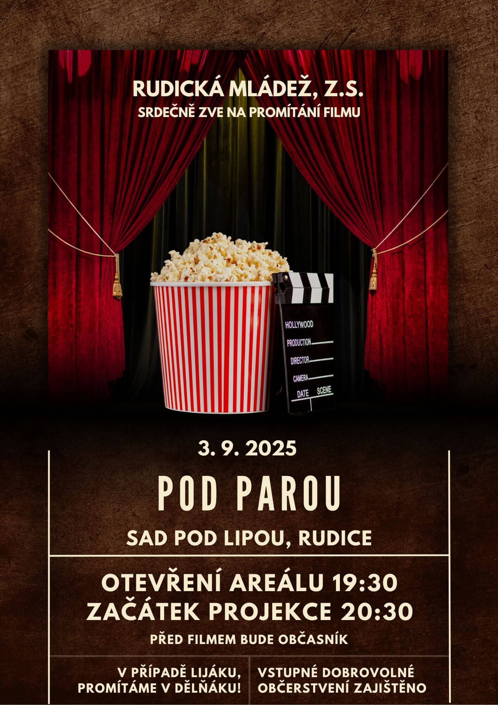

Srdečně vás zveme na naši letošní třetí projekci, která opět proběhne v&nbsp;krásném prostředí [Sadu pod Lipou](https://maps.app.goo.gl/PkK9S2EBhhUzFXkR6).
Nebojte v případě lijáku, promítáme v&nbsp;[dělňáku](https://maps.app.goo.gl/fRbT5FhzffHoAYcj7)!
Tentokrát jsme pro vás připravili film *Pod parou*. 🍷🥃🍻

<!--more-->

Vstupné dobrovolné. 🎟 📽 \
Datum: 3.&nbsp;9.&nbsp;2025 📅

Abychom vám večer ještě více zpříjemnili, je pro vás zajištěno občerstvení – těšit se můžete na něco dobrého k&nbsp;snědku i&nbsp;pití. 🍿🍻

Vlastní židle vítány, avšak budou nachystány obecní pivní sety. 🪑

## O filmu 🎞

Jedna vědecká teorie tvrdí, že se všichni rodíme s&nbsp;přirozeným nedostatkem alkoholu v&nbsp;krvi a&nbsp;náš organismus nejlépe funguje právě při dosažení a&nbsp;udržování jeho hladiny na úrovni 0,5&nbsp;promile.
Učitelka Martina a&nbsp;její tři kamarádky se s&nbsp;velkou vervou a&nbsp;nadšením pustí do bláznivého pokusu, kterým chtějí tuto teorii osobně prověřit.
Jakmile se jim podaří hladinku alkoholu dostat na potřebnou úroveň, hned jim to dodá větší lehkost při vyučování i&nbsp;nadhled při řešení osobních situací.
Jak se jejich experiment s&nbsp;pravidelnou konzumací alkoholu vyvine a&nbsp;co všechno způsobí, ukáže skvěle vystavěný příběh filmu Pod parou.
Film je adaptací úspěšného dánského oscarového filmu [Chlast](https://www.csfd.cz/film/734768-chlast/) z roku 2020.
Tvůrci ale učinili několik zásadních změn, především změnili hlavní čtveřici mužských hrdinů na ženské postavy a&nbsp;příběh adaptovali do prostředí moravského Mikulova. ([CinemArt](http://www.cinemart.cz/))

## Zpětná vazba

Vaše názory a&nbsp;pocity nám můžete zasílat pomocí toho [formuláře](https://forms.gle/N9mm1hwZkBXn8iMA8).

Navrhněte svůj oblíbený film do našeho výběru prostřednictvím krátkého formuláře: 📝 \
👉🏻 [Otevřít formulář](https://forms.gle/83aDkqcAj5nDmfj46)

