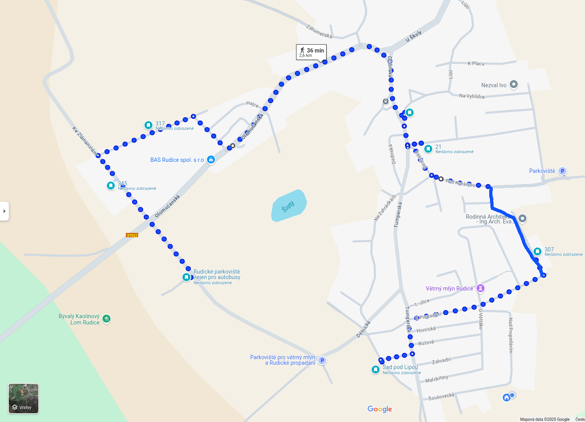

Surely you've wondered at some point which route our Saturday traditional-costume festival parade takes. 

<!--more-->

The parade starts at the [Rudice parking lot for buses](https://maps.app.goo.gl/mmqAVv9qUsHAzXPe6) at **2:30 PM**, and ends in the [Sad pod Lipou park](https://maps.app.goo.gl/EZE7RF37b2sy4rxk9).

This year’s stops:

1. [Kuchař family](https://maps.app.goo.gl/VL9g7kHxNYxscRKP6)  
1. [Urban family](https://maps.app.goo.gl/RUBiYNWJ8bkskZxi7)  
1. [Břoušek family](https://maps.app.goo.gl/UMDXTCdUtMjXEA3a9)  
1. [Martinásek family](https://maps.app.goo.gl/PA2shXpoducxzLR26)  
1. [Zouhar family](https://maps.app.goo.gl/1wgpUNzbhDWQsweW6)

